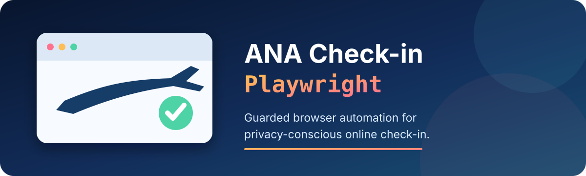
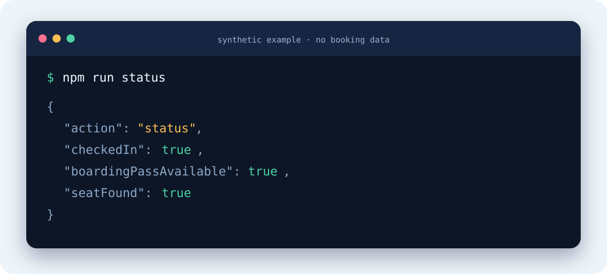

<div align="center">
  

# ANA Check-in Playwright

**Check in with ANA through a guarded Chromium workflow that keeps booking and passport data out of Git.**

[](LICENSE)
[](package.json)
[](#requirements)
[](#the-declaration-guard)

[Quick install](#quick-install) · [Commands](#commands) · [Safety](#why-use-it) · [Troubleshooting](docs/troubleshooting.md) · [Contributing](CONTRIBUTING.md)
</div>

## Quick install

```bash
git clone https://github.com/bee-san/ana-checkin-playwright.git
cd ana-checkin-playwright
npm install
cp .env.example .env
```

Add your booking details to `.env`, then load them locally:

```bash
set -a
source .env
set +a
npm run status
```

`.env`, browser profiles, screenshots and boarding passes are ignored by Git.

## See it



The example is synthetic. Real output reports state without printing the reservation locator, passenger name or passport information.

## Why use it?

A one-off browser script can mix personal data, brittle selectors and legal declarations into the same unchecked flow. This project separates those concerns and stops when ANA shows an unknown state.

| | Manual browser flow | Ad-hoc automation | This project |
|---|---|---|---|
| Read-only status check | Manual | Depends on the script | Dedicated `status` command |
| Booking secrets | Typed into the page | Often embedded in code or shell history | Environment variables in a gitignored file |
| Restricted-goods declaration | Passenger decides | Easy to tick blindly | Requires explicit passenger confirmation |
| Unexpected ANA page | Passenger judgement | May retry or click through | Refuses the state and stops |
| Cookies | Passenger choice | Often accepts everything | Leaves statistics and personalisation off |
| Boarding-pass output | Manual download | Varies | Private local artifact when ANA exposes its print window |

The reference flow completed a real ANA check-in with Chromium and Playwright. ANA can rate-limit repeated sessions, so the script submits once and never treats a processing screen as proof of success.

## Commands

| Command | What it does | Side effect |
|---|---|---|
| `npm run status` | Reads the live booking state | None |
| `npm run checkin` | Reviews and submits online check-in | Checks in the passenger |
| `npm run boarding-pass` | Opens ANA's print flow and writes a local PDF | Creates `artifacts/boarding-pass.pdf` |

### Check status

```bash
npm run status
```

This is the safest first command and the right command to rerun after a timeout.

### Complete check-in

The passenger must personally read ANA's baggage and restricted-goods information. Only after confirming that they are not carrying prohibited items should they set:

```bash
ANA_CONFIRM_BAGGAGE_RESTRICTIONS=YES
npm run checkin
```

### Issue a boarding pass

```bash
npm run boarding-pass
```

The pass is stored under `artifacts/` with private file permissions. Never commit it, upload it to an issue, or share its barcode publicly.

## The declaration guard

The script will not complete check-in unless all of these are true:

1. ANA reports the booking as `Not Checked-in`.
2. The review page is visible.
3. ANA's expected restricted-goods declaration is present.
4. `ANA_CONFIRM_BAGGAGE_RESTRICTIONS` equals `YES`.
5. The real checkbox state becomes checked and ANA enables **Next**.

If ANA changes its wording or page structure, the script stops rather than guessing.

## Requirements

- Node.js 20 or newer
- Google Chrome or Chromium
- macOS or Linux

Headful Chromium is the default because it was more reliable during the reference flow.

## Configuration

| Variable | Required | Purpose |
|---|---:|---|
| `ANA_RESERVATION_NUMBER` | yes | Six-character booking locator |
| `ANA_FIRST_NAME` | yes | Given name exactly as ticketed |
| `ANA_LAST_NAME` | yes | Family name exactly as ticketed |
| `ANA_CONFIRM_BAGGAGE_RESTRICTIONS` | check-in only | Must be `YES` after personal confirmation |
| `CHROME_EXECUTABLE` | sometimes | Chrome or Chromium path when auto-detection fails |
| `HEADLESS` | no | Defaults to `false` |
| `ANA_PROFILE_DIR` | no | Private browser-profile directory |
| `ANA_ARTIFACT_DIR` | no | Private output directory |
| `DEBUG_ARTIFACTS` | no | Saves local screenshots when `true` |

See [`.env.example`](.env.example) for safe placeholders.

## Documentation and support

- [Troubleshooting ANA errors, delayed processing and browser differences](docs/troubleshooting.md)
- [Security and privacy policy](SECURITY.md)
- [Contribution guide](CONTRIBUTING.md)
- [Example environment file](.env.example)

Before opening a public issue, remove reservation locators, names, travel-document data, browser storage, screenshots and boarding-pass barcodes.

## Contributing

Contributions are welcome, especially synthetic test fixtures, safer state detection and documentation fixes. Start with [CONTRIBUTING.md](CONTRIBUTING.md) and run:

```bash
npm run lint
npm run secret-scan
git diff --check
```

Thank you to everyone who helps make travel automation safer and less fragile. 💛

## Project notes

The README structure follows the principles in [3 Tips For Making a Popular Open Source Project in 2025](https://skerritt.blog/make-popular-open-source-projects/): explain the benefit immediately, show the project, make installation copy/pasteable, keep detailed documentation elsewhere, and give users obvious support and contribution paths.

This is an independent utility and is not affiliated with or endorsed by ANA. Airline pages and requirements can change without notice. The passenger remains responsible for accurate travel documents, declarations, airport procedures and compliance with airline and government rules.

## Licence

[MIT](LICENSE)
